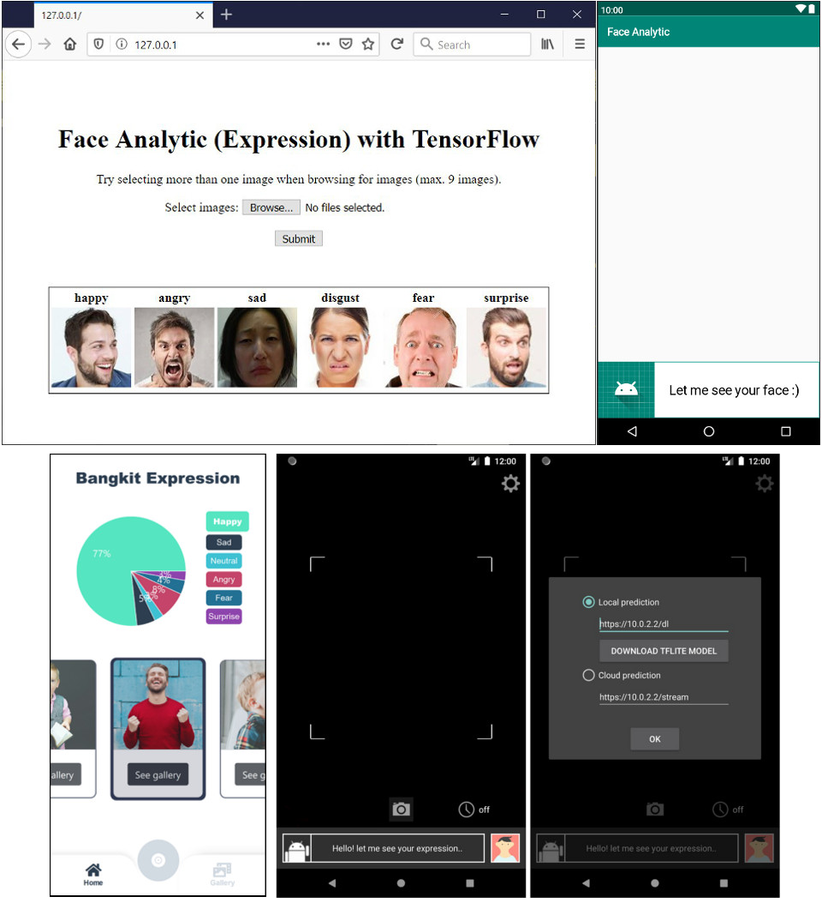

# Face Analytic (Expression) with TensorFlow
Copyright 2020  I Made Agus Dwi Suarjaya, Author 2, Author 3, Author 4
##
## Description
Try to analyze faces with TensorFlow and classify into 7 expressions (angry, disgust, fear, happy, neutral, sad, surprise).
#### Dataset Source [face expression recognition dataset](https://www.kaggle.com/jonathanoheix/face-expression-recognition-dataset)
##
## Deployment
#### Cloud [Python + Flask + Docker](https://github.com/agussuarjaya/Face_Analytic_-Expression-/tree/master/Server)
#### Android Deployment [Java + Android SDK](https://github.com/agussuarjaya/Face_Analytic_-Expression-/tree/master/Client)
##
## Related Front End 
#### [Web deployment](https://github.com/kobars/React-predict-face-expression)
#### [Android deployment](https://github.com/agussuarjaya/Face_Analytic_Android_-TFLite-Cloud-)
##
## Screenshot
